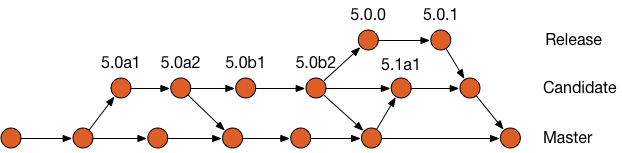
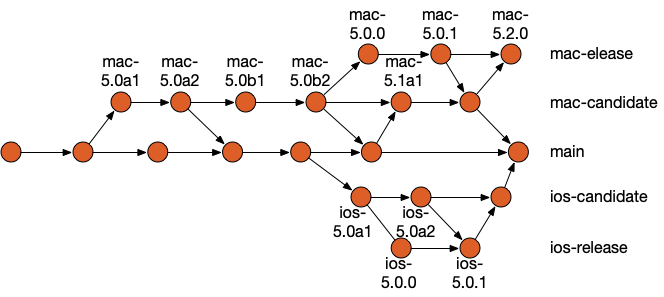

# NetNewsWire Branching Strategy

The main repository for NetNewsWire utilizes a [Trunk Based Development](https://trunkbaseddevelopment.com) branching strategy.  This branching strategy is a variant of [Three-Flow](https://www.nomachetejuggling.com/2017/04/09/a-different-branching-strategy/).

## Three-Flow

Three-Flow uses 3 branches to facilitate development, stabilize a release, and manage production hotfixes.  Development happens on Main and moves to a branch called Candidate when it is ready to be stabilized.  New feature development continues on Main and bug fixes to the release candidate happen on Candidate.  When the product is released, it is pushed to the Release branch. Hotfixes can happen on the Release branch.  Candidate is now free to be reused to stabilize the next release.  All bugs found and fixed are back merged to Candidate and then Main respectively.

All arrows going up are promotions (pushes) to the next environment.  All arrows going down are back ports of bugfixes.

That is Three-Flow applied to NetNewsWire.  It would be that simple, but we have two products we are going to deliver from the same repository.  The iOS and the macOS variants of NetNewsWire.  To stabilize and manage both variants, each will need to be given their own Candidate and Release branches.

Today (6/12/2019) we have 2 branches, main and macOS Candidate, in the main repository which will eventually grow to be 5 branches.

There will also be a number of repository forks that NetNewWire developers will create to do bug fixes and implement new features (not shown here).  Typically contributers will fork the Main branch to thier own repository.  They would then create a feature/bugfix branch on their repository.  Once work on thier forked branch is complete, they will submit a pull request to be merged back into the main repository main.

## Tagging

Each release should be tagged using [Semantic Versioning](https://semver.org/).  Candidates will continue to be tagged using the current convention which denotes the difference between developer, alpha and beta releases.  Additionally, we will need to use a convention to avoid tag name collisions between iOS and macOS products.  macOS releases will be suffixed with "mac-" and iOS releases will be suffixed with "ios-".  (See the above diagram for examples.)  

## Submodules

NetNewsWire uses Git submodules to manage project dependencies.  All the submodules are under the same project umbrella as NetNewWire and there are no third party dependencies to manage.  These submodules are mostly stable at this point.  For simplicity sake, all development on the submodules will continue on their repository Main branch.  These submodules won’t be managed as separate projects with separate releases/tags at this time.

## Summary

There are 3 types of branches: Main, Candidate, and Release.  All feature development happens on Main.  Stabilization happens on Candidate.  Hotfixes happen on Release.  Each product gets its own Candidate and Release branches.  All candidates and releases get tagged.
